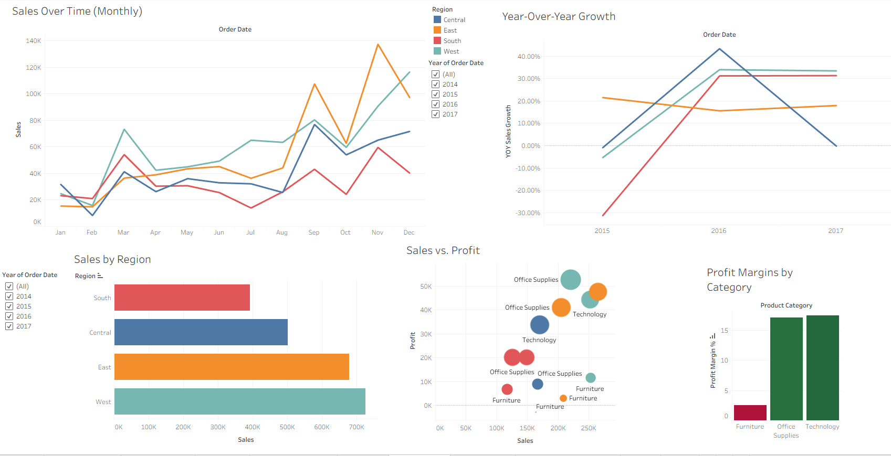

# Retail Sales Performance Dashboard made in Tableau

An interactive Tableau dashboard that analyzes company sales and profits over time, with KPI's including regional performance and profit margin insights.

### Goal
- Create a clear and interactive way to monitor sales trends, profit margins, and year-over-year performance by region.

### Data Source
- This dataset was downloaded from [Kaggle](https://www.kaggle.com/datasets/vivek468/superstore-dataset-final). It contains data from a fictitious superstore.

### Methods
-  Extracted raw data using PostgreSQL
-  Cleaned and transformed data using [Python automation](scripts/create_subset.py)
-  Analyzed data using SQL queries in PostgreSQL
-  Imported CSV into Tableau
-  Created calculated fields and interactive visualizations

### Key Features of the Dashboards
- KPIs: Total Sales, Total Profits, Average Profit Margin
- Sales Over Time: Monthly trend with Year-Over-Year comparisons
- Regional Performance: Filterable bar chart by region
- Category and Size Analysis: Profit margin breakdown
- Interactive Filters: Date range, region

### How to Use
1. Download the 'Dashboard.twbx' file from this repository:
    - [Click here to download](tableau/Dashboard.twbx)
2. Open Tableau Desctop or Tableau Public (desktop app)
3. Fo to **File -> Open**, then select the downloaded '.twbx' file
4. Interact with the dashboard filters to explore the data

### [SQL Queries](sql/superstore.sql)
1. Setting up data
2. Sales by Region
3. Sales Over Time (monthly)
4. Profit Margins by Category
5. Year-Over-Year Growth
    - Utilizes LAG() and PARTITION BY functions

